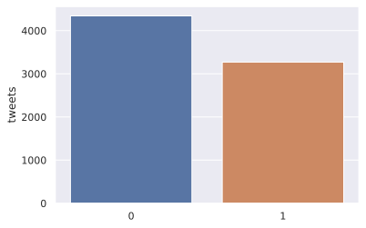
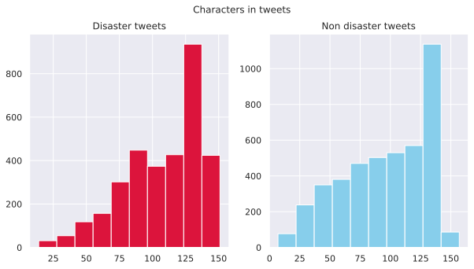
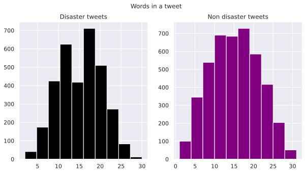
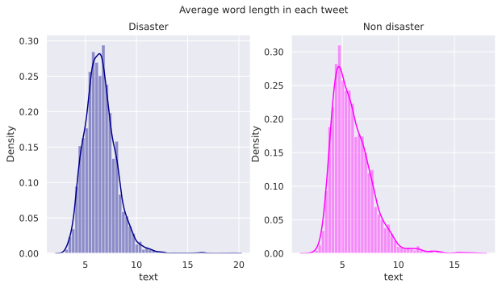
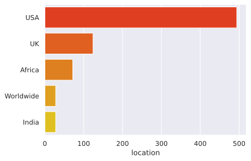
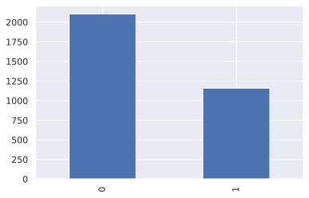

# KAGGLE: Natural Language Processing with Diaster Tweets
AUTHOR: SungwookLE  
DATE: '21.7/9  
DATA: https://www.kaggle.com/c/nlp-getting-started/overview  
REFERENCE: https://www.kaggle.com/mariapushkareva/nlp-disaster-tweets-with-glove-and-lstm

### Competition Description
  

 It’s not always clear whether a person’s words are actually announcing a disaster. [This tweet](https://storage.googleapis.com/kaggle-media/competitions/tweet_screenshot.png) explicitly uses the word “ABLAZE” but means it metaphorically. This is clear to a human right away, especially with the visual aid. But it’s less clear to a machine.  
 In this competition, you’re challenged to build a machine learning model that predicts which Tweets are about real disasters and which one’s aren’t. You’ll have access to a dataset of 10,000 tweets that were hand classified. If this is your first time working on an NLP problem, we've created a [quick tutorial](https://www.kaggle.com/philculliton/nlp-getting-started-tutorial) to get you up and running. Disclaimer: The dataset for this competition contains text that may be considered profane, vulgar, or offensive.  
 Another [reference](https://www.kaggle.com/andreshg/nlp-glove-bert-tf-idf-lstm-explained#7.-LSTM) is here.  

### DATA
#### 1) What am I predicting
- Predict whether a given tweet is about a real diaster or not. If so, predict a `1`, If not, predict a `0`.  

#### 2) Columns
- id - a unique identifier for each tweet
- text - the text of the tweet
- location - the location the tweet was sent from (may be blank)
- keyword - a particular keyword from the tweet (may be blank)
- target - in train.csv only, this denotes whether a tweet is about a real disaster (1) or not (0)


```python
import numpy as np
import pandas as pd
from subprocess import check_output
```


```python
print(check_output(['ls','input']).decode('utf8'))
```

    glove.6B.100d.txt
    glove.6B.100d.txt.zip
    nlp-getting-started.zip
    sample_submission.csv
    test.csv
    train.csv
    


```python
import matplotlib.pyplot as plt
%matplotlib inline

import seaborn as sns
sns.set()
```

## START
- Natural Language Processing 역시, 단어들을 전부다 Vectorize 해서, 각각에 class 를 붙인 다음에, twork에 feed시켜 학습시키는 것임
- 이 때, 단어는 앞 뒤 순서도 중요하기 떄문에, timesequence를 고려할 수 있는 LSTM같은 네트워크를 써본 것이고,
- 간단한 LinearClassifier 모델을 써도 성능은 65%정도 나오는듯 함

## 1. EDA(Exploratory Data Analysis, 탐색적 데이터 분석)


```python
train = pd.read_csv('input/train.csv')
test = pd.read_csv('input/test.csv')

train_len = len(train)
test_len = len(test)

train_id = train['id']
test_id = test['id']

train.drop('id',axis=1, inplace=True)
test.drop('id',axis=1, inplace=True)

train_label = train['target']

train.drop( 'target', axis=1, inplace=True)
all_data = pd.concat([train, test])

print(train.shape, test.shape)
print(all_data.shape)
all_data.tail()
```

    (7613, 3) (3263, 3)
    (10876, 3)


<div>
<style scoped>
    .dataframe tbody tr th:only-of-type {
        vertical-align: middle;
    }

    .dataframe tbody tr th {
        vertical-align: top;
    }

    .dataframe thead th {
        text-align: right;
    }
</style>
<table border="1" class="dataframe">
  <thead>
    <tr style="text-align: right;">
      <th></th>
      <th>keyword</th>
      <th>location</th>
      <th>text</th>
    </tr>
  </thead>
  <tbody>
    <tr>
      <th>3258</th>
      <td>NaN</td>
      <td>NaN</td>
      <td>EARTHQUAKE SAFETY LOS ANGELES ‰ÛÒ SAFETY FASTE...</td>
    </tr>
    <tr>
      <th>3259</th>
      <td>NaN</td>
      <td>NaN</td>
      <td>Storm in RI worse than last hurricane. My city...</td>
    </tr>
    <tr>
      <th>3260</th>
      <td>NaN</td>
      <td>NaN</td>
      <td>Green Line derailment in Chicago http://t.co/U...</td>
    </tr>
    <tr>
      <th>3261</th>
      <td>NaN</td>
      <td>NaN</td>
      <td>MEG issues Hazardous Weather Outlook (HWO) htt...</td>
    </tr>
    <tr>
      <th>3262</th>
      <td>NaN</td>
      <td>NaN</td>
      <td>#CityofCalgary has activated its Municipal Eme...</td>
    </tr>
  </tbody>
</table>
</div>


```python
# Checking the class distribution
x = train_label.value_counts()
sns.barplot(x.index, x.values)
plt.gca().set_ylabel('tweets')
```


    Text(0, 0.5, 'tweets')





```python
# Number of characters in tweets
fig, (ax1, ax2) = plt.subplots(1,2,figsize=(10,5))
train_text_len = train.loc[train_label==1]['text'].str.len()
ax1.hist(train_text_len, color='crimson')
ax1.set_title('Disaster tweets')

train_text_len = train.loc[train_label==0]['text'].str.len()
ax2.hist(train_text_len, color='skyblue')
ax2.set_title('Non disaster tweets')
fig.suptitle('Characters in tweets')
```


    Text(0.5, 0.98, 'Characters in tweets')





```python
# Number of words in a tweets
fig, (ax1, ax2) = plt.subplots(1,2,figsize=(10,5))
train_word_len = train.loc[train_label==1]['text'].str.split().map(lambda x: len(x))
ax1.hist(train_word_len, color = 'black')
ax1.set_title('Disaster tweets')

train_word_len = train.loc[train_label==0]['text'].str.split().map(lambda x: len(x))
ax2.hist(train_word_len, color = 'purple')
ax2.set_title('Non disaster tweets')
fig.suptitle('Words in a tweet')
```


    Text(0.5, 0.98, 'Words in a tweet')





```python
fig, (ax1, ax2) = plt.subplots(1,2,figsize=(10,5))
word = train.loc[train_label==1]['text'].str.split().apply(lambda x : [len(i) for i in x]).map(lambda x : np.mean(x))
sns.distplot(word, ax=ax1, color='darkblue')
ax1.set_title('Disaster')

word = train.loc[train_label==0]['text'].str.split().apply(lambda x : [len(i) for i in x]).map(lambda x: np.mean(x))
sns.distplot(word, ax=ax2, color='magenta')
ax2.set_title('Non disaster')
fig.suptitle('Average word length in each tweet')
```


    Text(0.5, 0.98, 'Average word length in each tweet')





```python
def create_corpus(target):
    corpus=[]
    for x in tweet.loc[tweet['target'] == target]['text'].str.split():
        for i in x:
            corpus.append(i)
    return corpus
```


```python
def create_corpus_df(tweet, target):
    corpus =[]
    for x in tweet.loc[tweet['target']==target]['text'].str.split():
        for i in x:
            corpus.append(i)
    return corpus
```

## 2. Feature Engineering
- 결측 데이터 채우고, 정리하기
- new/del feature


```python
# Renaming locations means

all_data['location']=all_data['location'].map({'United States':'USA',
                           'New York':'USA',
                            "London":'UK',
                            "Los Angeles, CA":'USA',
                            "Washington, D.C.":'USA',
                            "California":'USA',
                             "Chicago, IL":'USA',
                             "Chicago":'USA',
                            "New York, NY":'USA',
                            "California, USA":'USA',
                            "FLorida":'USA',
                            "Nigeria":'Africa',
                            "Kenya":'Africa',
                            "Everywhere":'Worldwide',
                            "San Francisco":'USA',
                            "Florida":'USA',
                            "United Kingdom":'UK',
                            "Los Angeles":'USA',
                            "Toronto":'Canada',
                            "San Francisco, CA":'USA',
                            "NYC":'USA',
                            "Seattle":'USA',
                            "Earth":'Worldwide',
                            "Ireland":'UK',
                            "London, England":'UK',
                            "New York City":'USA',
                            "Texas":'USA',
                            "London, UK":'UK',
                            "Atlanta, GA":'USA',
                            "Mumbai":"India"})

print(all_data['location'].value_counts())

sns.barplot(y = all_data['location'].value_counts()[:5].index, x = all_data['location'].value_counts()[:5],
            palette='autumn')
```

    USA          494
    UK           124
    Africa        72
    Worldwide     28
    India         28
    Canada        16
    Name: location, dtype: int64


    <AxesSubplot:xlabel='location'>





```python
import re
import string
def clean_text(text):
    '''Make text lowercase, remove text in square brackets,remove links,remove punctuation
    and remove words containing numbers.'''

    text = text.lower()
    text = re.sub('\[.*?\]', '', text)
    text = re.sub('https?://\S+|www\.\S+', '', text)
    text = re.sub('<.*?>+', '', text)
    text = re.sub('[%s]' % re.escape(string.punctuation), '', text)
    text = re.sub('\n', '', text)
    text = re.sub('\w*\d\w*', '', text)
    return text

# Applying the cleaning fuction to both test and traing datasets
all_data['text']= all_data['text'].apply(lambda x: clean_text(x))
# Let's take a look at the updated text
all_data['text'].head()
```


    0    our deeds are the reason of this earthquake ma...
    1                forest fire near la ronge sask canada
    2    all residents asked to shelter in place are be...
    3     people receive wildfires evacuation orders in...
    4    just got sent this photo from ruby alaska as s...
    Name: text, dtype: object


```python
#Removing Emojis
def remove_emoji(text):
    emoji_pattern = re.compile("["
                           u"\U0001F600-\U0001F64F"  # emoticons
                           u"\U0001F300-\U0001F5FF"  # symbols & pictographs
                           u"\U0001F680-\U0001F6FF"  # transport & map symbols
                           u"\U0001F1E0-\U0001F1FF"  # flags (iOS)
                           u"\U00002702-\U000027B0"
                           u"\U000024C2-\U0001F251"
                           "]+", flags=re.UNICODE)
    return emoji_pattern.sub(r'', text)
    
all_data['text']=all_data['text'].apply(lambda x: remove_emoji(x))
```


```python
all_data.values.shape
```


    (10876, 3)


## 3. Model
We are going to use LSTM (long short-term memory) model because it solves a vanishing gradient problem


```python
train_feed = all_data['text'][:train_len].values
test_feed = all_data['text'][train_len:].values
sentiments = train_label.values
```

We need to perform **tokenization** - the processing of segmenting text into sentences of words. In the process we throw away punctuation and extra symbols too. The benefit of tokenization is that it gets the text into a format that is easier to convert to raw numbers, which can actually be used for processing.


```python
from keras.preprocessing.text import Tokenizer
word_tokenizer = Tokenizer()
```

    Using Theano backend.


```python
word_tokenizer.fit_on_texts(train_feed)
vocab_length = len(word_tokenizer.word_index) + 1
```


```python
from sklearn.metrics import (
    precision_score,
    recall_score,
    f1_score,
    classification_report,
    accuracy_score
)

def metrics(pred_tag, y_test):
    print("F1-score: ", f1_score(pred_tag, y_test))
    print("Precision: ", precision_score(pred_tag, y_test))
    print("Recall: ", recall_score(pred_tag, y_test))
    print("Accuracy: ", accuracy_score(pred_tag, y_test))
    print("-"*50)
    print(classification_report(pred_tag, y_test))

def embed(corpus):
    return word_tokenizer.texts_to_sequences(corpus)
```


```python
def plot(history, arr):
    fig, ax = plt.subplots(1, 2, figsize=(20, 5))
    for idx in range(2):
        ax[idx].plot(history.history[arr[idx][0]])
        ax[idx].plot(history.history[arr[idx][1]])
        ax[idx].legend([arr[idx][0], arr[idx][1]],fontsize=18)
        ax[idx].set_xlabel('A ',fontsize=16)
        ax[idx].set_ylabel('B',fontsize=16)
        ax[idx].set_title(arr[idx][0] + ' X ' + arr[idx][1],fontsize=16)
```


```python
from keras.preprocessing.sequence import pad_sequences
from nltk.tokenize import word_tokenize
import nltk
nltk.download('punkt')

longest_train = max(train_feed, key=lambda sentence: len(word_tokenize(sentence)))
length_long_sentence = len(word_tokenize(longest_train))

train_padded_sentences = pad_sequences(embed(train_feed), length_long_sentence, padding='post')
test_padded_sentences = pad_sequences(embed(test_feed), length_long_sentence, padding='post')
```

    [nltk_data] Downloading package punkt to /home/joker1251/nltk_data...
    [nltk_data]   Package punkt is already up-to-date!


To obtain a vector representation for words we can use an unsuperviesed learning algorithm called **GloVe (Global Vectors for Word Representation), which focuses on words co-occurrences over the whole corpus. Its embeddings relate to the probabilities that two words appear together


```python
embeddings_dictionary = dict()
embeddings_dim = 100
glove_file = open('input/glove.6B.100d.txt')

for line in glove_file:
    records = line.split()
    word = records[0]
    vector_dimensions = np.asarray(records[1:], dtype='float')
    embeddings_dictionary[word] = vector_dimensions
glove_file.close()
```


```python
embedding_matrix = np.zeros((vocab_length, embeddings_dim))
for word, index in word_tokenizer.word_index.items():
    embedding_vector = embeddings_dictionary.get(word)
    if embedding_vector is not None:
        embedding_matrix[index] = embedding_vector
```


```python
from sklearn.model_selection import train_test_split
X_train, X_test, y_train, y_test = train_test_split(
    train_padded_sentences,
    sentiments,
    test_size=0.25)
```


```python
from keras.layers.embeddings import Embedding
from keras.models import Sequential
from keras.layers import (LSTM,
                          Embedding,
                          BatchNormalization,
                          Dense,
                          TimeDistributed,
                          Dropout,
                          Bidirectional,
                          Flatten,
                          GlobalMaxPool1D)

def BLSTM():
    model = Sequential()
    model.add(Embedding(input_dim = embedding_matrix.shape[0],
                        output_dim= embedding_matrix.shape[1],
                        weights = [embedding_matrix],
                        input_length = length_long_sentence))
    model.add(Bidirectional(LSTM(length_long_sentence, return_sequences = True, recurrent_dropout=0.2)))
    model.add(GlobalMaxPool1D())
    model.add(BatchNormalization())
    model.add(Dropout(0.5))
    model.add(Dense(length_long_sentence, activation='relu'))
    model.add(Dropout(0.5))
    model.add(Dense(length_long_sentence, activation ='relu'))
    model.add(Dropout(0.5))
    model.add(Dense(1,activation = 'sigmoid'))
    model.compile(optimizer = 'rmsprop', loss = 'binary_crossentropy', metrics= ['accuracy'])
    return model    
```


```python
from keras.callbacks import ModelCheckpoint, ReduceLROnPlateau

model = BLSTM()
checkpoint = ModelCheckpoint(
    'model.h5',
    monitor = 'val_loss',
    verbose = 1,
    save_best_only = True
)
reduce_lr = ReduceLROnPlateau(
    monitor = 'val_loss',
    factor=0.2,
    verbose =1,
    patience= 5,
    min_lr = 0.001
)
history = model.fit(
    X_train,
    y_train,
    epochs = 7,
    batch_size = 32,
    validation_data = [X_test, y_test],
    verbose = 1,
    callbacks = [reduce_lr, checkpoint]
)
```

    Train on 5709 samples, validate on 1904 samples
    Epoch 1/7
    5709/5709 [==============================] - 7s 1ms/step - loss: 0.8256 - acc: 0.5850 - val_loss: 0.6212 - val_acc: 0.7983
    
    Epoch 00001: val_loss improved from inf to 0.62122, saving model to model.h5
    Epoch 2/7
    5709/5709 [==============================] - 8s 1ms/step - loss: 0.5777 - acc: 0.7127 - val_loss: 0.5011 - val_acc: 0.8130
    
    Epoch 00002: val_loss improved from 0.62122 to 0.50109, saving model to model.h5
    Epoch 3/7
    5709/5709 [==============================] - 7s 1ms/step - loss: 0.5138 - acc: 0.7620 - val_loss: 0.4399 - val_acc: 0.8062
    
    Epoch 00003: val_loss improved from 0.50109 to 0.43985, saving model to model.h5
    Epoch 4/7
    5709/5709 [==============================] - 8s 1ms/step - loss: 0.4666 - acc: 0.7966 - val_loss: 0.4401 - val_acc: 0.8220
    
    Epoch 00004: val_loss did not improve
    Epoch 5/7
    5709/5709 [==============================] - 7s 1ms/step - loss: 0.4378 - acc: 0.8192 - val_loss: 0.4365 - val_acc: 0.8083
    
    Epoch 00005: val_loss improved from 0.43985 to 0.43648, saving model to model.h5
    Epoch 6/7
    5709/5709 [==============================] - 7s 1ms/step - loss: 0.4140 - acc: 0.8317 - val_loss: 0.5057 - val_acc: 0.8067
    
    Epoch 00006: val_loss did not improve
    Epoch 7/7
    5709/5709 [==============================] - 7s 1ms/step - loss: 0.4007 - acc: 0.8394 - val_loss: 0.4554 - val_acc: 0.8241
    
    Epoch 00007: val_loss did not improve


```python
plot(history, [['loss', 'val_loss'],['acc', 'val_acc']])
```


```python
loss, accuracy = model.evaluate(X_test, y_test)
print('Loss:', loss)
print('Accuracy: ', accuracy)
```

    1904/1904 [==============================] - 1s 297us/step
    Loss: 0.4553891943783319
    Accuracy:  0.8240546218487395


```python
preds = model.predict_classes(X_test)
metrics(preds, y_test)
```

    F1-score:  0.7744107744107744
    Precision:  0.7315521628498728
    Recall:  0.8226037195994278
    Accuracy:  0.8240546218487395
    --------------------------------------------------
                  precision    recall  f1-score   support
    
               0       0.89      0.82      0.86      1205
               1       0.73      0.82      0.77       699
    
        accuracy                           0.82      1904
       macro avg       0.81      0.82      0.82      1904
    weighted avg       0.83      0.82      0.83      1904
    


```python
#model.load_weights('model.h5')
preds = model.predict_classes(X_test)
metrics(preds, y_test)
```

    F1-score:  0.7744107744107744
    Precision:  0.7315521628498728
    Recall:  0.8226037195994278
    Accuracy:  0.8240546218487395
    --------------------------------------------------
                  precision    recall  f1-score   support
    
               0       0.89      0.82      0.86      1205
               1       0.73      0.82      0.77       699
    
        accuracy                           0.82      1904
       macro avg       0.81      0.82      0.82      1904
    weighted avg       0.83      0.82      0.83      1904
    


```python
submission = pd.DataFrame(columns=['id','target'])
```


```python
submission['target']=model.predict_classes(test_padded_sentences).squeeze()
submission['id']= test_id
submission.to_csv('output/submission.csv', index=False)
submission['target'].value_counts().plot.bar()
```


    <AxesSubplot:>





```python
submission.head()
```


<div>
<style scoped>
    .dataframe tbody tr th:only-of-type {
        vertical-align: middle;
    }

    .dataframe tbody tr th {
        vertical-align: top;
    }

    .dataframe thead th {
        text-align: right;
    }
</style>
<table border="1" class="dataframe">
  <thead>
    <tr style="text-align: right;">
      <th></th>
      <th>id</th>
      <th>target</th>
    </tr>
  </thead>
  <tbody>
    <tr>
      <th>0</th>
      <td>0</td>
      <td>1</td>
    </tr>
    <tr>
      <th>1</th>
      <td>2</td>
      <td>1</td>
    </tr>
    <tr>
      <th>2</th>
      <td>3</td>
      <td>1</td>
    </tr>
    <tr>
      <th>3</th>
      <td>9</td>
      <td>1</td>
    </tr>
    <tr>
      <th>4</th>
      <td>11</td>
      <td>1</td>
    </tr>
  </tbody>
</table>
</div>


## 4. (번외) Linear Model로 학습


```python
from sklearn import feature_extraction, linear_model, model_selection, preprocessing
```


```python
count_vectorizer = feature_extraction.text.CountVectorizer()

train_lnr=all_data[:train_len]
test_lnr=all_data[train_len:]
count_vectorizer.fit(train_lnr["text"])

train_vectors = count_vectorizer.transform(train_lnr["text"])
test_vectors = count_vectorizer.transform(test_lnr["text"])

```


```python
clf = linear_model.LogisticRegression(penalty='l2')
scores = model_selection.cross_val_score(clf, train_vectors, train_label, cv=3, scoring="f1")
print("SCORE using LinearModel is {:.3f}%".format(np.mean(scores)*100))

```

    SCORE using LinearModel is 63.403%


```python
clf.fit(train_vectors, train_label)
clf.predict(train_vectors)
sub = pd.DataFrame()
sub['id'] = test_id
sub['target'] = pd.Series(clf.predict(test_vectors))
print(sub.shape)
sub.head()
```

    (3263, 2)


<div>
<style scoped>
    .dataframe tbody tr th:only-of-type {
        vertical-align: middle;
    }

    .dataframe tbody tr th {
        vertical-align: top;
    }

    .dataframe thead th {
        text-align: right;
    }
</style>
<table border="1" class="dataframe">
  <thead>
    <tr style="text-align: right;">
      <th></th>
      <th>id</th>
      <th>target</th>
    </tr>
  </thead>
  <tbody>
    <tr>
      <th>0</th>
      <td>0</td>
      <td>1</td>
    </tr>
    <tr>
      <th>1</th>
      <td>2</td>
      <td>1</td>
    </tr>
    <tr>
      <th>2</th>
      <td>3</td>
      <td>1</td>
    </tr>
    <tr>
      <th>3</th>
      <td>9</td>
      <td>1</td>
    </tr>
    <tr>
      <th>4</th>
      <td>11</td>
      <td>1</td>
    </tr>
  </tbody>
</table>
</div>


### CounterVectorizer 란,


```python
count_vectorizer = feature_extraction.text.CountVectorizer()
a=[['WHAT IS'], ['COUNT VECTORIZER'], ['SungwookLE TEST']]
a = pd.DataFrame(a, columns=['text'])
print(a)
print()
example_vectors = count_vectorizer.fit_transform(a["text"])
# we use .todense() here bacause these vectors are "sparse" (only non-zero elements are kept to save space)
print(example_vectors[0].todense().shape)
print(example_vectors[0].todense())
```

                   text
    0           WHAT IS
    1  COUNT VECTORIZER
    2   SungwookLE TEST
    
    (1, 6)
    [[0 1 0 0 0 1]]


## 끝
